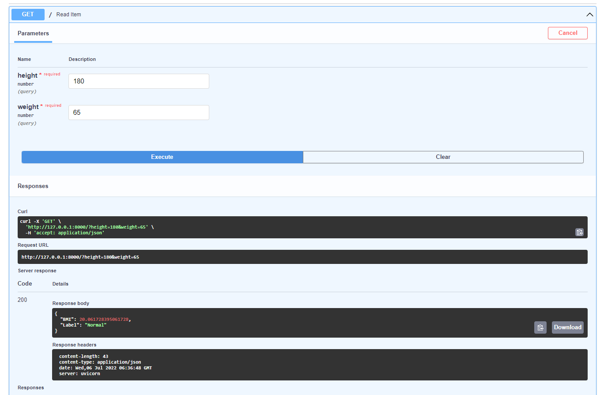

## Access  API

`https://mtommyp.com/bmi`

## Requirment

- fastapi==0.78.0
- pydantic==1.9.1
- python-dotenv==0.20.0
- uvicorn==0.18.2
- virtualenv-clone==0.5.7

---

## Test

- **inputs:** height(_inches_), weight(_pounds_)
- **outputs:** BMI

---

## Results

### FastAPI Docs:

# restapibmicalcu
# restapibmicalcu
